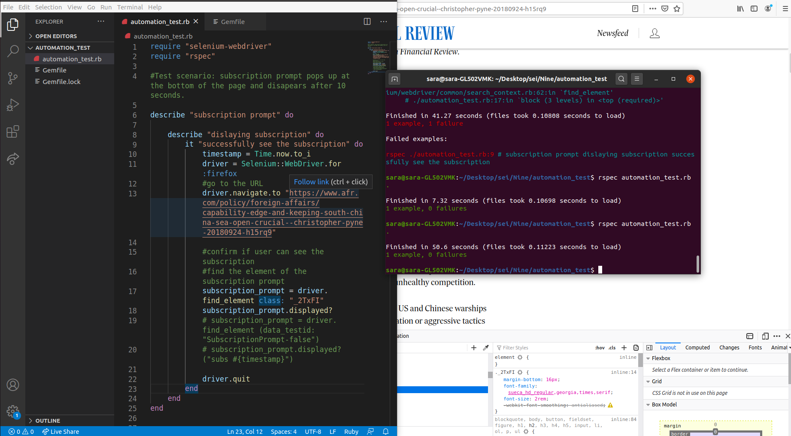
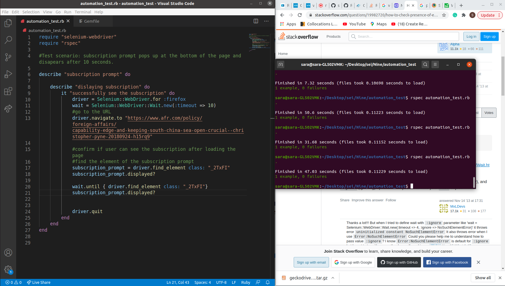
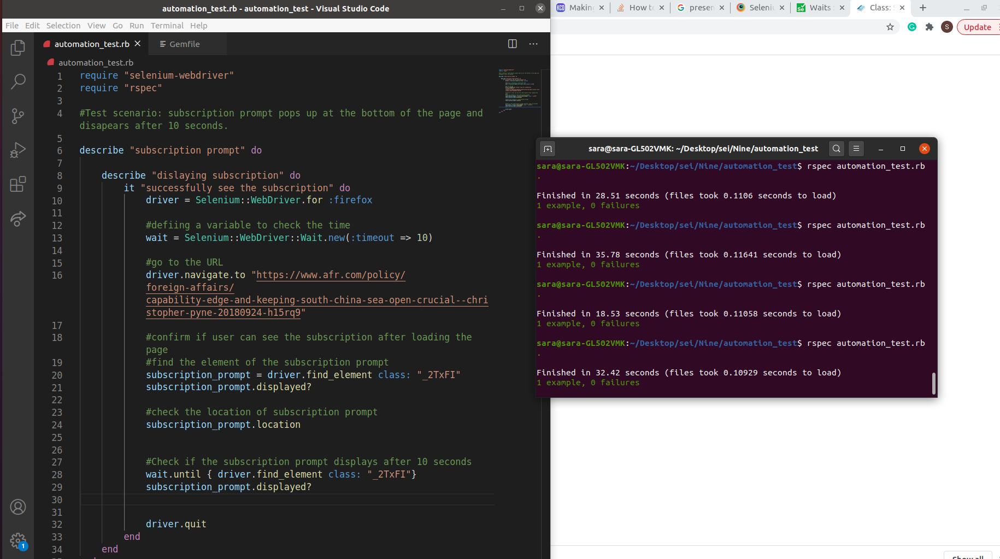

# Automation test 
The UI automation was implemented to test if the subscription prompt pops up at the bottom of the page in firefox using Selenium WebDriver and it disappears after 10 seconds
## Which element will be tested?
The subscription prompt
## What is the test scenario?
* Launch this url
* Check if the subscription prompt is popped up from the bottom of the page
* Scroll down to the end of the page
* Wait for 10 seconds (utmost)
* Verify if the subscription pop up disappears on the same article

* **LAnguage** - Ruby
* **Open-source tool** - Selenium WebDriver
## setup and run steps
### step 1: installing Selenium
I went through the Selenium dev website and downloaded the Selenium for Ruby.

### step2: Using gemfile
I installed bundler, made a GemFile, and downloaded GemFile for linux64 

### Step3: Installing geckodriver
I installed geckodriver to make sure to have the browser driver setup.

### Step4: Start building the selenium WebDriver structure
I made a Ruby file (automation_test.rb). I used Selenium WebDriver for Firefox and used the quit method to close the driver session. 

### Step4: Navigate the driver to the URL
I navigated the driver to the URL in line16.

### Step5: 
* I searched the element to test (the subscription prompt) in line20.
* I found the class name of the subscription prompt div from the browser.

### Step6: Doing action
* I Started to do actions. I used display action to check if the subscription prompt displays on the page after loading.

* I used "wait" to run the drive after 10 seconds again.

* I used "location" to check the location of the subscription prompt.

### Step7: installing rspec
I installed the rspec using bundle to check the expectations.

### Step8: run the test
I run the test using rspec automation_test.rb command.

## Challenges
### challenge1:
I faced plenty of syntax errors.

### Challenge2:
It cannot download the geckodriver. So, I changed the path in the terminal. It did not work, So I installed the sodu version.

### Challenge3:
The driver cannot find the element. I changed the element from the div to the title of the div.

## Challenges I still need to explore
Although the test passed, getting the location of the element to check it pops up from the bottom of the page need to be checked again.

