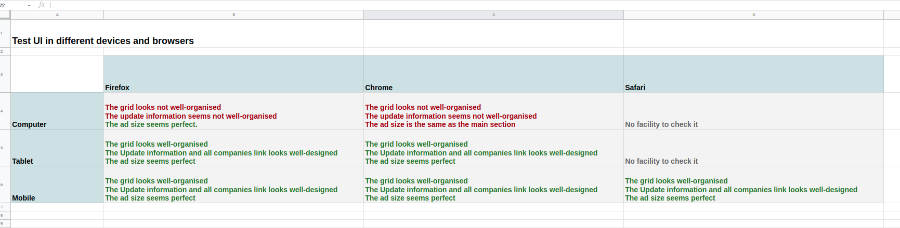

# Exploratory Testing

## Thinking process
### Frist step
Learning about the page and the main goal of it. 

#### What is it?
* It is a financial paper

#### What is the business's needs?
* Publishing accurate and concise news about companies.
* Usability and accessibility of the page
* Giving as much as possible information to the user in the least time.

#### Who is the audience of it?
##### implicit
* Businesses
* Company clients
* Investers

##### explicit
* Financial reviewers
* company members
* People interested in financial news

##### Persona Testing
* **Age** - 40-65
* **Job** - Businessman - Marketing Manager - Executive Director - Acountant - (They have professianl careers)
* **Location** - Anywhere in the world - On the plane
* **Accessibility** - They might need glasses (Zoom in feature is needed) 

### Second Step

### Test functionality
#### What we have in the section (Companies in the news)
* Section title
* Company Name (Clickable)
* Company Brand (Clickable)
* Rate & Ratio of each brand
* Updated information
* All Companies link (Clickable)
* Search box including input box and search button (Clickable)
* Advertisement (Clickable)

#### Mind mapping 
I did brainstorm using Mindmup.
Please click the [link here](https://drive.google.com/file/d/11Im1fH65VdWQ_qZzGZ6Ft2aog0bzE7ty/view?usp=sharing) to see the mind map in mindmup. If you cannot access the link, please look at the figure below.

#### Test the functions
Test scenario | Test case | Preconditions | Test Steps | Expected result | Actual Result | Pass/Fail
--- | --- | --- | --- | --- | --- | --- 
Clicking on the search button after writing a valid name in the search box | Check response clicking search button | writing a valid company name in the search box | write a valid company name in the search box - click the search button | successfully go to the company page | do nothing | Fail
Clicking on the search result after writing a valid name in search box | Check response clicking on the search result | writing a valid company name in the search box | write a valid company name in the search box - click the search result | successfully go to the company page | successfully go to the company page | Pass
Clicking on the search button after writing nothing in the search box | Check the response to the blank search | nothing | Clicking on the search button | showing an alert to fill the field | showing an alert to fill the field | Pass
Clicking on the search button after writing an invalid name in the search box | Check the response to an invalid search | writing an invalid text | search an invalid text in the search box - Click the search button | showing an alert to write a valid name | nothing | Fail
Clicking on company names| Check response clicking on the link | nothing | nothing | Successfully go to the company page | Successfully go to the company page | Pass
Clicking on company brands| Check response clicking on the link | nothing | nothing | Successfully go to the company page | Successfully go to the company page | Pass
Clicking on the All Companies link| Check response clicking on the link | nothing | nothing | Successfully go to the company lists | Successfully go to the company lists | Pass
Clicking on advertisement| Check response clicking on the link | nothing | nothing | Successfully go to the ad page | Successfully go to the ad page | Pass
### Test UI in different devices and browsers
* **Firefox** 
* **Chrome**  
* **Safari** 

* **Laptop**
* **Tablet**
* **Mobile**
* Please click the [link here](https://docs.google.com/spreadsheets/d/1D4OJI2TJaegStWWI4GHoa9xqtC5IaErsI1go1PyUTEE/edit?usp=sharing) to see the test UI in different devices and browsers. If you cannot access the link, please look at the figure below.

### Test User Quality Experience (based on the audience)
* **Accessibility** - Suggestion - users might have sight issues without wearing glass based on their age range. So, the zoom-in feature can help to improve the quality of the section.
* **Usability** - Positive point - Most of the users of this section can have professional careers. So, they are busy. The section should give them as much information as possible in the least amount of time. 
* **Color** - Positive point - Using the proper color of green and red helps the users to find their goals as soon as possible.
* **Proportion** (the relative size and scale of various elements in a design) - Suggestion - According to the rule of thirds, the most important part of the section doesn't have an important message on the computer screen.

